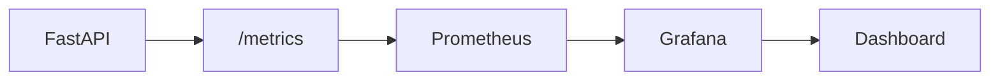
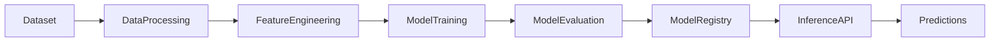

# Churn Risk Prediction Service (DevOps + MLOps Architecture)

This project implements a **Churn Risk Prediction microservice** built using FastAPI and integrated with a complete **DevOps lifecycle** including containerization, CI/CD, monitoring, and API observability.

The system predicts **customer churn risk** using contract type and support ticket history derived from the Telco Customer Churn dataset.

The project demonstrates two complementary architectures:

- **DevOps Architecture** — infrastructure, CI/CD, containerization, monitoring
- **MLOps Architecture** — data pipeline, feature engineering, model training, inference

---

# Project Objectives

The goal of this project is to demonstrate a production-ready machine learning service using modern DevOps practices.

Key capabilities implemented:

- REST API for churn risk prediction
- Rule-based risk evaluation engine
- Automated testing pipeline
- Docker containerization
- Continuous Integration (CI)
- Continuous Deployment (CD)
- Monitoring and observability
- API documentation
- Deployment automation

---

# Repository Structure

```

MLOps-A01
│
├── src
│   ├── app.py
│   ├── rule_engine.py
│   └── feature_pipeline.py
│
├── data
│   ├── raw
│   └── processed
│
├── scripts
│   ├── generate_tickets.py
│   ├── prepare_customers.py
│   └── validate_tickets.py
│
├── tests
│   ├── test_api.py
│   └── test_rule_engine.py
│
├── monitoring
│   ├── prometheus.yml
│   └── docker-compose.monitoring.yml
│
├── grafana
│   └── devops-dashboard.json
│
├── docs
│   └── API.md
│
├── Dockerfile
├── requirements.txt
└── README.md

````

---

# DevOps Architecture

The DevOps pipeline manages service deployment, monitoring, and automation.

```mermaid
flowchart TD

Developer --> GitHubRepo
GitHubRepo --> CI

CI --> Tests
CI --> DockerBuild

DockerBuild --> DockerHub
DockerHub --> Deployment

Deployment --> FastAPI

FastAPI --> Metrics
Metrics --> Prometheus
Prometheus --> Grafana

Grafana --> Monitoring["System Monitoring"]
Monitoring --> Developer
````

### Components

| Component      | Purpose                  |
| -------------- | ------------------------ |
| GitHub         | Source control           |
| GitHub Actions | CI pipeline              |
| Docker         | Containerization         |
| DockerHub      | Image registry           |
| FastAPI        | API microservice         |
| Prometheus     | Metrics monitoring       |
| Grafana        | Observability dashboards |

---

# Continuous Integration Pipeline

CI automatically runs whenever code is pushed to the repository.

Pipeline stages:

1. Install dependencies
2. Run unit tests
3. Build Docker image
4. Validate container build

```mermaid
flowchart TD

CodePush --> GitHubActions
GitHubActions --> InstallDependencies
InstallDependencies --> RunTests
RunTests --> BuildDockerImage
BuildDockerImage --> PushDockerHub
```

---

# Monitoring and Observability

The service exposes Prometheus metrics for monitoring.

Example metrics:

* `prediction_count_total`
* `api_request_count_total`
* `api_request_latency_seconds`

Monitoring architecture:



Grafana dashboards display:

* prediction request rate
* API request latency
* total predictions served
* API traffic patterns

---

# MLOps Architecture

The assignment also describes an MLOps pipeline for model training and prediction.

Although the current system uses a rule-based model, the architecture is designed to support a full ML lifecycle.



### MLOps Pipeline Stages

| Stage               | Description                      |
| ------------------- | -------------------------------- |
| Data ingestion      | Load Telco churn dataset         |
| Feature engineering | Extract ticket behavior features |
| Model training      | Train churn prediction model     |
| Evaluation          | Validate model performance       |
| Deployment          | Serve model through API          |

---

# Feature Engineering

Features used by the churn prediction logic:

| Feature              | Description                                 |
| -------------------- | ------------------------------------------- |
| contract_type        | Customer contract duration                  |
| tickets_last_30_days | Number of support tickets in the last month |
| complaint_ticket     | Whether complaint tickets exist             |
| negative_ratio       | Ratio of negative sentiment tickets         |

---

# Churn Risk Rules

Risk categories are determined by rule-based logic.

| Condition                              | Risk   |
| -------------------------------------- | ------ |
| Month-to-month contract + many tickets | HIGH   |
| Moderate ticket activity               | MEDIUM |
| Stable contract and few issues         | LOW    |

---

# API Overview

Base URL

```
http://localhost:8000
```

Endpoints:

| Endpoint        | Method | Description                   |
| --------------- | ------ | ----------------------------- |
| `/`             | GET    | Health check                  |
| `/predict-risk` | POST   | Predict churn risk            |
| `/metrics`      | GET    | Prometheus monitoring metrics |

Interactive API documentation:

```
http://localhost:8000/docs
```

---

# Running the Service

### Run locally

```
uvicorn src.app:app --host 0.0.0.0 --port 8000
```

---

### Run using Docker

```
docker build -t churn-risk-service .
docker run -p 8000:8000 churn-risk-service
```

---

# Running Monitoring Stack

```
cd monitoring
docker compose -f docker-compose.monitoring.yml up
```

Services:

| Service    | URL                                            |
| ---------- | ---------------------------------------------- |
| Prometheus | [http://localhost:9090](http://localhost:9090) |
| Grafana    | [http://localhost:3000](http://localhost:3000) |

---

# Testing

Run all tests using:

```
pytest
```

Test coverage includes:

* API endpoint testing
* rule engine validation
* prediction logic verification

---

# Observability Dashboard

Grafana dashboards visualize system metrics such as:

* prediction traffic
* API latency
* request rate

The dashboard configuration is stored in:

```
grafana/devops-dashboard.json
```

---

# Dataset

The system uses the **Telco Customer Churn dataset**, which contains:

* customer demographics
* subscription information
* billing details
* service usage patterns

Additional ticket data is synthetically generated to simulate support interactions.

---

# Technologies Used

| Category         | Technology     |
| ---------------- | -------------- |
| API Framework    | FastAPI        |
| Language         | Python         |
| Containerization | Docker         |
| CI/CD            | GitHub Actions |
| Monitoring       | Prometheus     |
| Visualization    | Grafana        |
| Testing          | Pytest         |

---

# Future Improvements

Potential extensions include:

* replacing rule engine with ML model
* automated feature pipelines
* model registry integration
* Kubernetes deployment
* real-time streaming predictions

---

# Mootha Sri Harshith - 2022BCS0096

---
